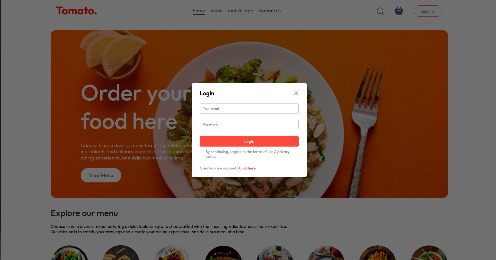
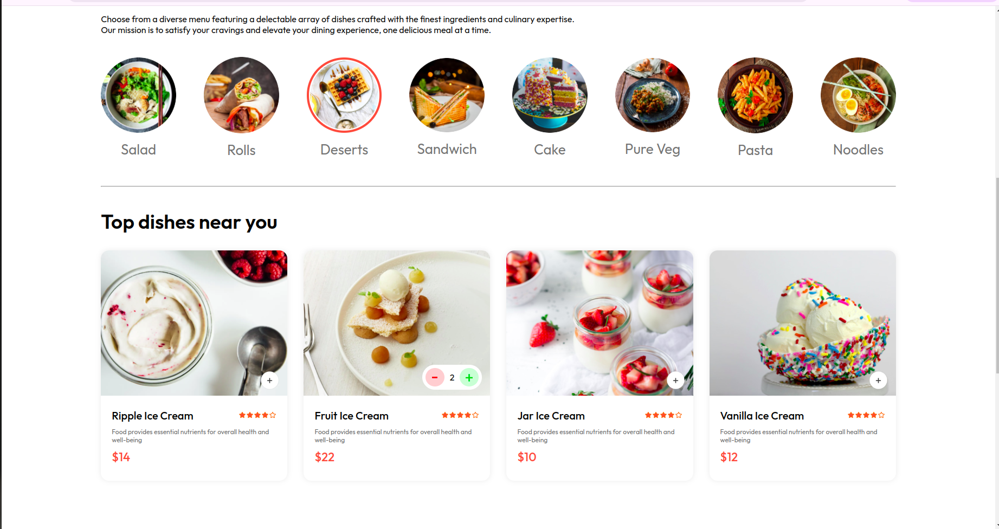
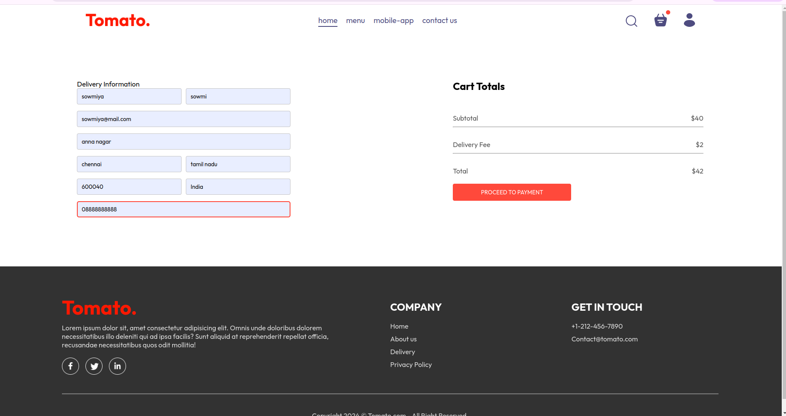

# DishDelight Food Delivery Website 🚚🍕🍜
## Overview

DishDelight is a full-stack food delivery app built with Node.js, MongoDB, and React.js, featuring Stripe integration for secure payment processing. This app offers a seamless experience for customers to explore food options, place orders, and make payments, while also providing an admin dashboard to manage orders and track analytics. An order tracking feature is currently under development to enhance real-time user engagement.

# Features

## Order Placement & Payment: 
  Users can browse food items, place orders, and securely pay through Stripe.
## Admin Dashboard:
  Accessible only to admins for managing orders, tracking revenue, and updating menu items.
## Order Tracking (Upcoming):
  Real-time tracking to show order status, providing transparency to users.
  Tech Stack
  
## Frontend:
React.js
## Backend:
Node.js, MongoDB
## Payment Integration:
Stripe API

# Installation

## Clone the repository:
bash
Copy code
git clone https://github.com/sowmiya-AppDeveloper/FullStackWeb.git
Navigate to the project folder and install dependencies for both frontend and backend:

1.bash

2.Copy code

3.cd FullStackWeb

4.cd client

5.npm install

Set up environment variables for Stripe, MongoDB, and any necessary API keys.

## Run the development server:
1.bash

2.Copy code

3.cd FullStackWeb

4.cd Server

# Upcoming Enhancements
Order Tracking: Real-time updates on order status.
Enhanced Analytics: Expanded metrics and reporting in the admin dashboard.

# Contributions
Feel free to fork and submit pull requests for enhancements!

# ScreenShorts

# AdminPanel ScreenShorts

